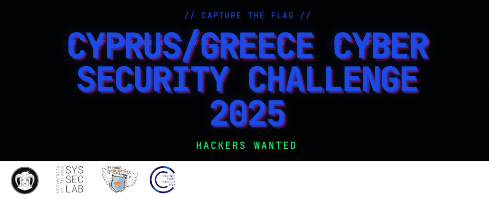

# Cyprus Cyber Security Challenge CTF 2025

**Dates:** 27/06/2025 - 13/07/2025

## Repository Structure

This is the official repository with the challenges published in Cyprus Cyber Security Challenge (CCSC) CTF 2025. Each challenge has a public, solution and setup folder (if applicable) and is accompanied with a short description. The setup folder contains all the files required to build and host the challenge and usually contains the flag and a proof of concept solution as well. The public folder contains the files that are released to the participant during the competition.

This year, the competition is co-organised by Team Cyprus and Team Greece!

**Flag format**: ECSC{this_is_a_flag}

## Dependencies

Although some of the challenges may run as is, it is recommended that you have docker and docker-compose installed and use the provided scripts to run the challenges to ensure isolation and therefore proper environment setup.

## Challenges

### crypto

| Name | Author |
| ---- | ------ |
| [Asteromata](./crypto/asteromata) | rasti |
| [Gamble Auction](./crypto/gamble-auction) | [Gramthanos](https://github.com/gramthanos) & rasti |
| [The Truth](./crypto/the-truth) | [GramThanos](https://github.com/GramThanos) |
| [This is different](./crypto/this-is-different) | [P3taByte](https://x.com/0xp374) © [Zer0Tolerance](https://x.com/0tolerance_ctf) |
| [This is different - Revenge](./crypto/this-is-different-revenge) | [P3taByte](https://x.com/0xp374) © [Zer0Tolerance](https://x.com/0tolerance_ctf) |

### forensics

| Name | Author |
| ---- | ------ |
| [Cursed Locker](./forensics/cursed-locker) | canopus |
| [HexCell Hunt](./forensics/hexcell-hunt) | _dark_darkl0rd_ |
| [Hive Heist](./forensics/hive-heist) | _dark_darkl0rd_ |
| [TVBox](./forensics/tvbox) | [GramThanos](https://github.com/GramThanos) |
| [Volatile Expert Pt. 1](./forensics/volatile-expert-pt-1) | canopus |
| [Volatile Expert Pt. 2](./forensics/volatile-expert-pt-2) | canopus |
| [Volatile Expert Pt. 3](./forensics/volatile-expert-pt-3) | canopus |
| [Volatile Expert Pt. 4](./forensics/volatile-expert-pt-4) | canopus |
| [Volatile Expert Pt. 5](./forensics/volatile-expert-pt-5) | canopus |
| [Volatile Expert Pt. 6](./forensics/volatile-expert-pt-6) | canopus |

### misc

| Name | Author |
| ---- | ------ |
| [Blackjack](./misc/blackjack) | [GramThanos](https://github.com/GramThanos) |
| [CalculAItor](./misc/calculaitor) | [GramThanos](https://github.com/GramThanos) |
| [Date MCP](./misc/date-mcp) | [GramThanos](https://github.com/GramThanos) |
| [Disorder](./misc/disorder) | rok0s |
| [High-Low](./misc/high-low) | [GramThanos](https://github.com/GramThanos) |
| [Holding Secrets](./misc/holding-secrets) | k4rt0fl3r |
| [Pot Pouri](./misc/pot-pouri) | wizard_alfredo |
| [Welcome](./misc/welcome) | CCSC Team |
| [You've got a flag in me](./misc/you-ve-got-a-flag-in-me) | tratrafe2 |

### pwn

| Name | Author |
| ---- | ------ |
| [Log Recorder](./pwn/log-recorder) | [r3dsh3rl0ck](https://github.com/R3dSh3rl0ck) |
| [pwnb0t](./pwn/pwnb0t) | [r3dsh3rl0ck](https://github.com/R3dSh3rl0ck) |
| [shellcode](./pwn/shellcode) | s3nn |
| [Station Maintenace](./pwn/station-maintance) | [r3dsh3rl0ck](https://github.com/R3dSh3rl0ck) |
| [zer0-2](./pwn/zer0-2) | zer0heir |
| [zer0cool](./pwn/zer0cool) | zer0heir |

### reverse

| Name | Author |
| ---- | ------ |
| [Anti-tricks](./reverse/anti-tricks) | [kallenosf](https://github.com/kallenosf) |
| [Gatekeeper](./reverse/gatekeeper) | rok0s |
| [Just a Key](./reverse/just-a-key) | [GramThanos](https://github.com/GramThanos) |
| [Up for GRUBs](./reverse/up-for-grub) | canopus |

### web

| Name | Author |
| ---- | ------ |
| [Cheesy Web](./web/cheesy-web) | [deltaclock](https://github.com/deltaclock) & [GramThanos](https://github.com/GramThanos) |
| [Memes](./web/memes) | [GramThanos](https://github.com/GramThanos) |
| [Popcorn and Payloads](./web/popcorn) | [kallenosf](https://github.com/kallenosf) |
| [Popcorn and Payloads (Repacked)](./web/popcorn-repacked) | [kallenosf](https://github.com/kallenosf) |
| [Remote Control](./web/remote-control) | [GramThanos](https://github.com/GramThanos) |
| [Remote Control - Revenge](./web/remote-control-revenge) | [GramThanos](https://github.com/GramThanos) |
| [The Missing Essence](./web/the-missing-essence) | [GramThanos](https://github.com/GramThanos) |

