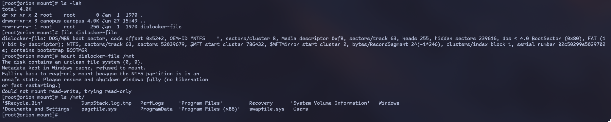

# Cursed Locker

We are given an archive containing `disk.vdi` and `memory.raw`, and we know they originated from a Windows 11 system.

To mount the `disk.vdi` image we can use `qemu-nbd` as so:

1. `sudo modprobe nbd max_part=8`
1. `sudo qemu-nbd --connect=/dev/nbd0 disk.vdi`

After we can list the partitions:


The partition in question if `/dev/nbd0p3`, let's try mounting it:


We have a Bitlocker encrypted partition!

Recendly a [blog](https://noinitrd.github.io/Memory-Dump-UEFI/) was released, diving into ways to recover the Bitlocker Key from a memory dump of a __Windows 11__ machine:

> The first place I located the FVEK key was under the dFVE pool tag, which indicates memory allocated by dumpfve.sys, which pertains to the full volume encryption crash dump filter for bitlocker drive encryption. The pool tag is underlined in blue while the FVEK key is highlighted in red. This was the easiest and most consistent location I found the key, and it is also prefaced by 0x0480 which indicates the type of encryption being used, which in my case is XTS-AES-128.

As such, we can look for the `dFVE` pool tag in the memory and then find any references to `0x0480` that appear near it. We can easily do this using `xxd` and `rg`:

```bash
$> xxd memory.raw | rg "dFVE" -A 10 | rg 0480 -B 10 -A 10
[...]
292e70c0: 0400 0000 6446 5645 0070 8e5c 8fc9 ffff  ....dFVE.p.\....
292e70d0: 0040 0000 0000 0000 0000 0000 0000 0000  .@..............
292e70e0: 7065 f357 8fc9 ffff 2c00 0000 0100 0100  pe.W....,.......
292e70f0: 0480 0000 620a 7f30 89fe 9eec 6fc5 35a3  ....b..0....o.5.
292e7100: d0f7 0c04 b941 466e 418f 308d 0890 7a40  .....AFnA.0...z@
292e7110: 64f5 29b8 0000 0000 0000 0000 0000 0000  d.).............
292e7120: 0000 0000 0000 0000 0000 0000 0000 0000  ................
292e7130: 0000 0000 0000 0000 f0ea fb7a 01f8 ffff  ...........z....
[...]
```

We find a part of the memory that matches the output, so the key in question should be:

`620a7f3089fe9eec6fc535a3d0f70c04b941466e418f308d08907a4064f529b8`

Following the instructions from the blog, we can output it into a binary form using:

`echo 0480620a7f3089fe9eec6fc535a3d0f70c04b941466e418f308d08907a4064f529b8 | xxd -r -p > fvek.key`

__Don't__ forget the prefix `0x0480`!

Now we can use `dislocker`, and as per the description the latest `-git` version, to mount the Bitlocker Partition as such:


Browsing to the `mount` folder we will see `dislocker-file`. This is the decrypted partition that we also need to mount as well:



The flag is in `\\Users\\User\\Desktop\\flag.txt`!
