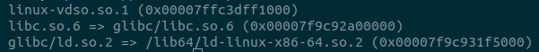
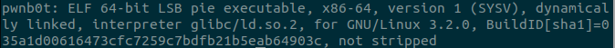
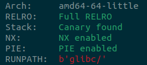
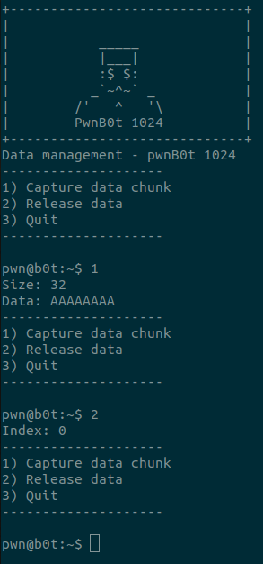
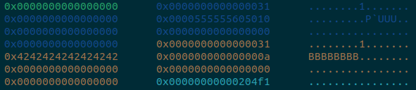
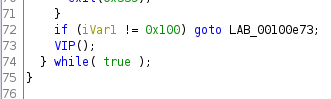
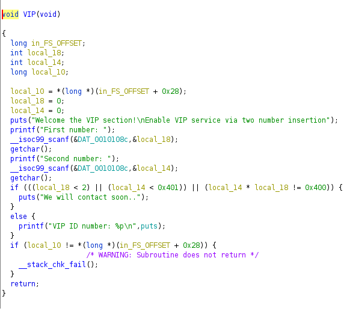
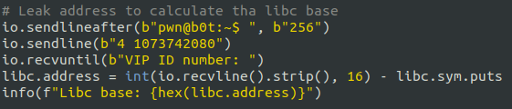
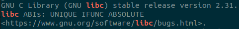
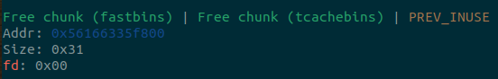

# pwnb0t


- Difficulty: Hard


## Steps
| N/A | Process
|-----------|-------:|
| 1 | Find the secret value by reverse engineering.|
| 2 | Provide the correct numbers to gain the leak.
| 3 | Calculate the libc base
| 4 |Find the libc version to identify possible vulnerabilities.|
| 5 | Identify the reverse tcache to fastbin bug
| 6 | Exploit the double-free bug to gain arbitrarily
| 7 | Overwrite the libc's `free_hook` with `system` |
| 8 | Write `/bin/sh` to a heap chunk |
| 9 |"Free" that chunk, system("/bin/sh) to spawn a shell. |


# Challenge Overview


# Description


```
Data management made easy with pwnb0t-1024
```


# Solution


## Get familiar with the binary


We are provided with an `elf binary` and a `glibc folder` containing the libc shared object that the binary uses. We can confirm that by typing `ldd pwnb0t`.





Let's start by checking the binary details with the `file` command.





The binary is dynamically linked, meaning that it is linked to the libc library by a libc object and not stripped, meaning that we can easily decode its symbols.


Last but not least, we should check the security mitigations.





All mitigations are present, so we should investigate more.


By the first run, we can assume that it's about a heap exploitation challenge. Capturing and releasing data operations are more possible than allocating and freeing data.





We can confirm this by running the binary in gdb.





After some time spent playing around with the binary, I decided to decompile it with Ghidra.


From the decompilation, I found that if I insert the `256` value, I get prompted with a VIP registration process.





The VIP function looked like this.





This is a condition we should bypass to get the `puts` function working properly (a libc leak).


If we type in two numbers where the first one is bigger than 1 and the second one is bigger than 1024 and their multiplication result is 1024, we will have a LIBC leak.


Of course this is not possible with the given condition, but in c we have limits in integers numbers. For example, `-1 = 4294967295 (0xffffffff)`. We weren't able to choose the 1024 representation and 1 because the first number should be greater than 1. The solution here was to find a number that is perfectly divided by numbers greater than 1. A valid combination was `4 and 1073742080`, where 1073742080 = 4294968320 / 4. (4294968320 = 1024)


With this combination, I was able to leak libc puts and substract its offset from the libc object to find the libc base with the following code:





The next step was to identify the glibc version, which was easy by inspecting the given libc shared object.





So this is `2.31` version, various vulnerablities are present on this version. The specific binary was vulnerable to reverse tcache to fastbin with a double free bug. This was the technique that helped me gain an arbitrary write and spawn my shell.


## Process


The process is simple:


1. Allocate 8 chunks of the same size.
2. Free all the chunks.
3. Allocate 7 chunks of the same size as before.
4. Free the 8th chunk again (double free).





At this point, the chunk is in the tcache bin and fastbin simultaneously.


1. Allocate the same size chunk and write the libc__free_hook address, 0x10 (fastbin metadata). At this point, we have allocated the libc__free_hook memory space.
2. Write `/bin/sh` on the heap.
3. Overwrite the libc__free_hook with system
4. Free this chunk, which leads to system (/bin/sh)`


An exploit is provided to describe the exploitation process.


pwn3d!


