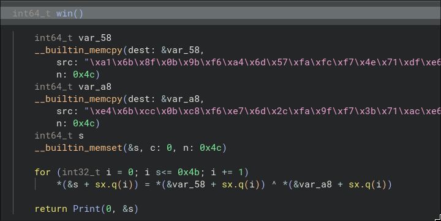

# Up for GRUBs

This challenge was heavily influenced by a forensic challenge in the French ECSC quals from 2024 (Donated for CWTE (Compete with Team Europe) 2024). I adopted it as a reversing challnge.

We are provided a `bootx64.efi` file. After examining a bit, we can find the sections:


There is a `mods` section that begins with `migm` and contains a couple of ELF files. This can also be confirmed by running `binwalk` on the profided `.efi` file:

```bash
$> binwalk bootx64.efi

DECIMAL       HEXADECIMAL     DESCRIPTION
--------------------------------------------------------------------------------
0             0x0             Microsoft executable, portable (PE)
72888         0x11CB8         ESP Image (ESP32): segment count: 11, flash mode: QUOUT, flash speed: 40MHz, flash size: 1MB, entry address: 0x0, hash: none
122912        0x1E020         ELF, 64-bit LSB relocatable, AMD x86-64, version 1 (SYSV)
126112        0x1ECA0         ELF, 64-bit LSB relocatable, AMD x86-64, version 1 (SYSV)
129584        0x1FA30         ELF, 64-bit LSB relocatable, AMD x86-64, version 1 (SYSV)
134224        0x20C50         ELF, 64-bit LSB relocatable, AMD x86-64, version 1 (SYSV)
```

Looking closer at the arrangement of the ELFs in the `mods` section, reveals an interesting pattern:

If we grab the last 4 bytes before the ELF magic and we add them to the offset of the first ELF:


`0x1E020 + 0xc80 = 0x1ECA0`

We get a strong hint of a TLV chain!

Let's extract them and open them up in our dissassmbler:

```python
elf_offsets = [0x1E020, 0x1ECA0, 0x1FA30, 0x20C50]

with open(sys.argv[1], "rb") as f:
    boot = f.read()

for i, off in enumerate(elf_offsets):
    # read length part of TLV
    l = struct.unpack_from("I", boot, off - 4)[0]

    data = boot[off : off + l]

    with open(f"elf_{hex(off)}_{i}", "wb") as f:
        f.write(data)
```

From here, let's stand on the 2nd ELF, since it contains an intereting line within:


This iterates over the `mods` section and if the object type is `1 (OBJ_TYPE_MEMDISK)` this signifies the module at hand is the `memdisk`:


Lastly, the code skips the first `0x100` and XOR decrypts the rest of the memdisk:

```python
# dump tail
tl = struct.unpack_from("I", boot, off + l - 4)[0]

data = boot[off + l : off + l + tl]

with open("tail.bin", "wb") as f:
    f.write(data[:0x100])
    f.write(bytes([x ^ key[i % len(key)] for i, x in enumerate(data[0x100:])]))
```

```bash
$> file tail.bin
tail.bin: POSIX tar archive
```

Let's extract the `tar` archive:

```bash
tar -xvf ../tail.bin
boot/grub/x86_64-efi/acpi.mod
[...]
boot/grub/x86_64-efi/video.lst
boot/grub/grub.cfg
grub.efi
```

No need to check the `x86_64-efi` directory, let's focus on the `grub.cfg` first:

```txt
set timeout=menu

insmod part_gpt
insmod chain

set root=(memdisk)
halt
```

Nothing special going on but we see the `halt` instruction which is why if we tried running this with

```bash
qemu-system-x86_64 \
  -machine q35 \
  -m 512M \
  -bios /usr/share/ovmf/x64/OVMF.4m.fd \
  -drive file=disk.img,if=ide,format=raw \
  -monitor stdi
```

The machine would just exit!

The only thing left to check out is the `grub.efi` binary:


Again nothing special here as well, however there is a `win()` function in this binary:



A simple XOR will reveal the flag!

## Implementation Details

Since a lot of people have asked me how I created the challenge, below you will find some implementaion details:

### grub.efi Binary

The `grub.efi` binary was build using `gnu-efi` from the following source code:

```c
#include <efi.h>
#include <efilib.h>
#include <wchar.h>


void win() {
    char key[] = {[...]};
    char ct[] = {[...]};
    char flag[76] = {0};
    for (int i=0;i<76;i++) { flag[i] = key[i] ^ ct[i]; }
    Print((const CHAR16 *)&flag);
}

EFI_STATUS EFIAPI efi_main (EFI_HANDLE ImageHandle, EFI_SYSTEM_TABLE *SystemTable) {
    InitializeLib(ImageHandle, SystemTable);
    Print(L"Hello, World!\n");
    Print(L"LMAO, Goodbye\n");

    SystemTable->RuntimeServices->ResetSystem(EfiResetShutdown, EFI_SUCCESS, 0, NULL);

    for (;;) { BS->Stall(1000000); }  // sleep ~1 second

    if (0) { win(); }
    return EFI_SUCCESS;
}
```

and Makefile:

```makefile
ARCH=x86_64
OBJS=hello.o
TARGET=hello.efi
EFIINC=/usr/include/efi
EFIINCS=-I$(EFIINC) -I$(EFIINC)/$(ARCH) -I$(EFIINC)/protocol
LIB=/usr/lib64
EFILIB=/usr/lib
EFI_CRT_OBJS=$(EFILIB)/crt0-efi-$(ARCH).o
EFI_LDS=$(EFILIB)/elf_$(ARCH)_efi.lds
CFLAGS=$(EFIINCS) -fpic -ffreestanding -fno-stack-protector -fno-stack-check -fshort-wchar -mno-red-zone -maccumulate-outgoing-args -Wall -DEFI_FUNCION_WRAPPER
LDFLAGS=-shared -Bsymbolic -T $(EFI_LDS) -L $(EFILIB) -L $(LIB) $(EFI_CRT_OBJS)

all: $(TARGET)
hello.so: $(OBJS)
	ld $(LDFLAGS) $(OBJS) -o $@ -lgnuefi -lefi
%.efi: %.so
	objcopy -j .rodata -j .text -j .sdata -j .data -j .dynamic -j .dynsym -j .rel -j .rela -j .rel.* -j .rela.* -j .reloc --target=efi-app-$(ARCH) --subsystem=10 $^ $@
clean:
	rm -rf hello.o hello.efi hello.so
```

Following the tutorial [here](https://www.rodsbooks.com/efi-programming/hello.html). I had to add the `.rodata` section to the `objcopy` cmdline to make the constan strings ("Hello World") available (thanks to p0fs for helping me out with this)

### GRUB Standalone Image

The `bootx64.efi` is a created through `grub-mkstandalone` which will package everything needed for a direct boot after UEFI is setup:

```bash
./grub/build/grub-mkstandalone \
  -O x86_64-efi \
  -d ./grub/build/grub-core/test \
  -o bootx64.efi \
  --disable-cli \
  --modules="part_gpt" \
  "boot/grub/grub.cfg=grub.cfg" \
  "grub.efi=$(pwd)/hello/hello.efi"
```

The standalone image is build with almost no modules, so even in rescue mode players couldn't `ls` a directory.

### GRUB Source modification

The GRUB source code was modified in order to add the XOR encryption and decryption routines:

- `utils/grub-mkstandalone.c`

```c
#define XOR_KEY "\x88[...]"
#define XOR_LEN (sizeof XOR_KEY - 1)
static int flag;

int main(int argc, char *argv[]){ 
    [...]
    write_zeros(512);
    /* Canopus Changes */
    // get size
    fseek(memdisk, 0L, SEEK_END);
    long sz = ftell(memdisk);
    // malloc size and read
    fseek(memdisk, 0, SEEK_SET);
    char * buffer = malloc(sz);
    fread(buffer, 1, sz, memdisk);

    for (long i=0x100;i<sz;i++) { buffer[i] ^= XOR_KEY[i % XOR_LEN]; }

    // write back
    fseek(memdisk, 0, SEEK_SET);
    // FILE * test = fopen("test.out", "wb");
    fwrite(buffer, 1, sz, memdisk);
    // cleanup
    free(buffer);
    /* Canopus Changes END!*/
    fclose(memdisk);
    [...]
}
```

- `grub-core/disk/memdisk.c`

```c
#define XOR_KEY "\x88[...]"
#define XOR_LEN (sizeof XOR_KEY - 1)

GRUB_MOD_INIT(memdisk) {
    int off = 0x100;
    struct grub_module_header *header;
    FOR_MODULES(header)
    if (header->type == OBJ_TYPE_MEMDISK) {
        char *memdisk_orig_addr = (char *)header + sizeof(struct grub_module_header);

        grub_dprintf("memdisk", "Found memdisk image at %p\n", memdisk_orig_addr);

        if (grub_sub(header->size, sizeof(struct grub_module_header), &memdisk_size)) {
            grub_error(GRUB_ERR_OUT_OF_RANGE, "underflow detected while obtaining memdisk size");
            return;
        }

        memdisk_addr = grub_malloc(memdisk_size);
        if (memdisk_addr == NULL) return;

        /* Canopus Changes */
        for (long i=off;i<memdisk_size;i++) { memdisk_orig_addr[i] ^= XOR_KEY[i % XOR_LEN]; }
        /* Canopus Changes END */
        
        grub_dprintf("memdisk", "Copying memdisk image to dynamic memory\n");
        grub_memmove(memdisk_addr, memdisk_orig_addr, memdisk_size);
        grub_disk_dev_register(&grub_memdisk_dev);
        break;
    }
}
```

### Notes

- The reason for the `halt` in the `grub.cfg` is so that players could not (easily) dump the memory from the qemu monitor w/ `dump-guest-memory`. Even after dumping, players would still have to carve the memdisk out of the snapshot
- The flag was xored as well, so in the event of dumping the memory, the flag would not have been visible in the snapshot (CWTE 2024 challenge)
